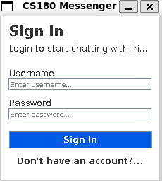
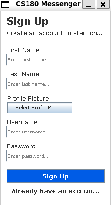
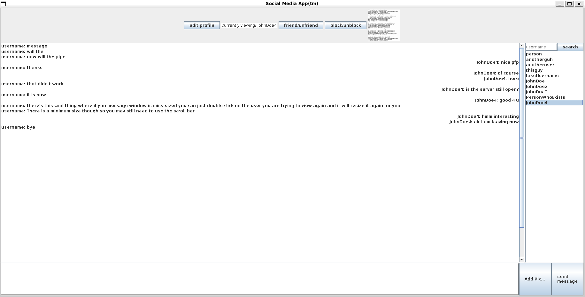

# Welcome to the our social media app (tentatively named "SocialMediaApp")

This was our final project for Problem Solving And Object-Oriented Programming (CS 18000) at Purdue University. Contributers to this project were 

This readme gives a brief introduction to all of the classes and functions of our app so far. For more detailed documentation visit the Docs folder: [Documentation](Docs/). 

# How to run
At this stage in the project (phase 2) this app does not run with an actual GUI. This means that messageing does not look very good, but it does function with real time messaging as when one client sends a message to another client (that is currently logged in) it will appear in the termainl running the receiving client. These messages do not appear on the sender side at the current moment because of how we handle the terminal, this will be easily fixed when a GUI is implemented. To run the project as intended, navigate to the [compiled/ folder](compiled/) and run the server first by typing
```bash
$ java MediaServer 8080
``` 
in your terminal. Then run the Client by typing in another terminal:
```bash
$ java SignInGUI 8080
```
Then you should be able to interact with the client based on the terminal prompts. For information about the prompts visit [Client.md](Docs/Client.md). If you cannot use the port 8080, you can change the port just by running them with different arguments. This means you should not need to recompile any of the classes already in the compiled folder. 

Our project also has a version where communication between the server and the client are encrypted using RSA encryption, however this makes the app run significantly slower, so I included both the encrypted and decrypted version. If you want to run the version that includeds the RSA encryption, run the same commands from the [cryptoCompiled folder](cryptoCompiled/).

# Submissions
William Boulton - Phase 1 submitted on Vocarium on November 3. 
William Boulton - Phase 2 submitted on Vocarium on November 17.
William Boulton - Phase 3 submitted to Vocarium workspace on December 8.
William Boulton - Report and Presentation submitted on Brightspace on December 8.

# Interfaces
Our file contains four interfaces, one for each main file. This means we have an interface for users, the userDatabase, messages, and the messageDatabase. The interfaces pair with the java classes as follows:
 - UserDBInt.java : UserDatabase.java
 - UserInt.java : User.java
 - MData.java : MessageDatabase.java
 - MessageInterface.java : Message.java
 - BadDataExceptionInt.java : BadDataException.java
 - ServerInterface.java : MediaServer.java
 - UserClientInt.java : UserClient.java

These files contain necessary methods for each of the classes that implement them. At this point, none of them contain any global variables that get used by the implementing classes and none of them are implemented in more than one class. This does not mean that there will not be implementations for more classes later. 

The ExceptionInterface is just an empty interface as teh BadDataException exception is a simple call to the Exception class. 

# Messages
Message handling is contained in two files, MessageDatabase.java and Message.java. Broadly, we store all of the messages that a user recieves and sends in a file named "username.txt" (where username is replaced with the username of the in-question user). Each message is stored as a single pipe separated value (psv) line of the format "messageID|sender|reciever|content|containsPicture|pictureFile" (It is important to note that the pictureFile string and preceding comma do not exist if containsPicture is false). For more information about this visit [Message Data](Docs/MessageDataStorage.md). 

_Message.java_

This class handles the creation and manipulation of the message object. It holds all of the information necessary to send a message to another user, including message content (text), an internal message id, the sender and reciever usernames, and (optionally) a picture. 
Per the interface, it contains the following methods:
```java
    String getSender();
    String getReciever();
    String getContent();
    byte[] getPicture();
    boolean hasPicture();
    String toString();
    int getMessageID();
    void editMessage(String content); 
    void addPicture(byte[] pictureContent);
    void editPicture(byte[] pictureContent);
    void readMessage(); // currently not in use
    void setMessageID(int id);
```
Not all of which are currently under use. It contains two constructors, one for creating messages based on psv lines stored in the database files and one for creating new messages with the sending user, recieving user, and message content. Messages are not initiallized with a picture, they must be added after the creation of the message. For more information about this, visit [Message Data](Docs/MessageDataStorage.md).

_MessageDatabase.java_

This class handles all of the data storage for messages and allows for users to send, delete, and edit messages. Per the interface, it contains the following methods:
```java
    ArrayList getSentMessages();
    ArrayList getRecievedMessages();
    void recoverMessages();
    User getUser();
    String getFilePath();
    void sendMessage(Message m) throws BadDataExeption;
    void deleteMessage(Message m) throws BadDataException;
    void editMessage(Message m, Message n) throws BadDataException; 
``` 
The most important methods in this file are recoverMessages(), which retrieves all of the user's sent and recieved messages and stores them in two different arrayLists, and the send, edit, and delete Message methods. This class also validates who messages can be sent to before making adjustments to a user's messages in the sendMessage file. It checks to make sure that the reciever has not blocked the sender, and if the reciever only allows friends to send messages it checks if the sender is a friend.
Each MessageDatabase object represents the message data for an individual user. This user is stored in the field 
```java
private User user
```
for more information about how these files are formatted or how the methods within the MessageDatabase class function, see [Message Data](Docs/MessageDataStorage.md).

# Users
User handling is contained within two files, UserDatabase.java and User.java. Briefly, we store all of the users for the app in a single file named "users.txt" and read through that whenever we need to re-initialize the app. Each user is stored as a single psv line containing all of the private information and friendship information of the user. Each line is stored in the following format: 
username|password|firstName|lastName|friends|blockedUsers|profilePicture
for more detials on what each field represents, see [User Data](Docs/UserDatabasing.md).

_User.java_

This class handles the user object, which is created for each person who uses the social media app. It stores all of the information regaurding a user's friends, blocked users, and account information. To handle this information, the file has the following methods:
```java
    boolean addFriend(User user);
    boolean removeFriend(User user);
    boolean blockUser(User user);
    boolean unblockUser(User user);
    String getUsername();
    boolean verifyLogin(String password);
    boolean equals(User user);
    String toString();
    BufferedImage getProfilePicture();
    void changeUsername(String newUsername);
    void changePassword(String newPassword);
    String listToString(ArrayList<User> list);
```
Methods generally work as expected, more information on the methods can be found at [User Data](Docs/UserDatabasing.md). The verify login method checks if the user's inputted password matches the password that they have previously set for their account. This check directly using the String.equals() method. When the app is implemented over a network this will be insecure and is subject to change. The listToString method represents an ArrayList as a comma separated string similar to the way Arrays are represented using the Arrays.toString() method. 

_UserDatabase.java_

This class interacts with the User.java file in order to create and handle users contained within the database. It also handles all of the reading and writing to the "users.txt" file. To handle this, it contains the following methods: 
```java
    void createUser(String username, String password, String firstName, String lastName, String profilePicture)
        throws BadDataException;
    void removeFriend(User user, User friend);
    void addFriend(User user, User friend)
    void blockUser(User user, User blockedUser);
    boolean unblockUser(User user, User blockedUser);
    User getUser(String username);
    boolean verifyLogin(String username, String password);
    void changeUsername(User user, String newUsername);
    boolean legalPassword(String password);
    void writeDB(User user);
    void updateDB();
    void load();
```
The load function handles reading through all of the users written to "users.txt" upon start up and storing them in the program once again. The writeDB function writes all of the users stored in program memory (an arraylist) to the "users.txt" file to be reused again later. Validating user creation happens in this file, where we ensure that the password and other user inputs are valid. Blocking, unblocking, Friending, and unfriending is all handled within this class as well. For more information on UserDatabase.java, see [User Data](Docs/UserDatabasing.md)

# Network
All of networkIO is handled between two files, the [server](MediaServer.java) file and the [client](UserClient.java) file. The server file handles all interaction with the database and sends either strings through a printwriter or objects (users) through an object output stream. The client file handles user's interactions with the server and displaying messages. At this point in time, we do not persistently display messages on the terminal, this will be implemented with the gui, however, there is an action that can be made to read all of your messages from another user. Real time messaging does work to an extent. If a user is logged in, and another user sends them a message, they will see that message appear in ther terminal in string form with the title card "INCOMING". These messages will be displayed in a more elegant way when a GUI is implemented. 

_MediaServer.java_
The MediaServer file works as the primary server for all database interaction and client handling. It works by creating a new thread for each client that connects with lambda function that runs the run() method with the arguments of the socket and serversocket. The run method then gets a desginated thread with that socket and server socket to interact with the client that just connected. 

This class has two static fields:
```java
    private static UserDatabase database;
    public static final Object lock = new Object();
```
The user database is the only user database that gets created and it gets created upon running the main method. The object "lock" is used to prevent threading issues when interacting with shared resources. 

The media server class handles all database operations in two methods. One method handles all operations related to the user database and the other handles all operations related to message databases. The signatures for the two methods follow
```java
    public static void userHandling(PrintWriter writer, String line) {
    public static User messageHandling(PrintWriter writer, String line, MessageDatabase messageDatabase, User viewing) {
```
The user handling only needs to take in the arguments of the printwriter that sends all information to the client and the line that was sent from the client asking for an operation. However, the message handling class needs to recieve the messageDatabase for the user that is logged in (which is retrieved by the server when the client connects) and the other user that the current client is "viewing" (when there is a gui this would relate to the conversation that they are viewing). This allows it to call the methods previously implemented by messageDatabase. 
userHandling() calls all of the functions previously implemented by UserDatabase.java and User.java. messageHandling() handles functions prviously implemented by MessageDatabase.java or Message.java. For more information or information about the interface view [Server.md](Docs/Server.md).

_UserClient.java_
The [UserClient.java](UserClient.java) file handles all user interaction with the server. Currently, it runs everything out of the terminal, which will not be the final design of the project. Eventually, all interactions will happen in a GUI rather than using the terminal, but that is going to be implemented during phase 3. Besides the temporary main method which allows interaction with the server through the terminal, this file sends all necessary requests to call any operation permitted by the server. To see which functions are available, see documentation for the server. 

This class has the following fields:
```java
    private User user;
    private BufferedReader reader;
    private PrintWriter writer;
    private Socket socket;
    private ObjectInputStream input;
    private static int portNumber;
```
and the following methods per the interface:
```java
    String sendMessage(String receiver, String content, String picture) throws BadDataException, IOException;
    void deleteMessage(int id) throws BadDataException, IOException;
    String editMessage(int id, String newContent) throws IOException;
    void blockUser(String u) throws IOException;
    boolean unblockUser(String u) throws IOException;
    boolean addFriend(String u) throws IOException;
    boolean removeFriend(String u) throws IOException;
    boolean setUserName(String name) throws IOException;
    boolean setPassword(String password) throws IOException;
    void addOrRemoveFriend(String username) throws IOException;
    void blockOrUnblock(String username) throws IOException;
```
These functions handle all of the requests that may be sent to the server while a client is interacting with the app. This class was entirly tested manually because it is not able to get any information from the database without the use of network io. To learn more about this class, view [Client.md](Docs/Client.md).

# GUI
GUI is created and processed in two different files, SignInGUI.java and GUIClient.java. The GUIClient.java file handles the main GUI that a user interacts with to send messages, view users, edit their profile, add friends or block users, and interact with messages. The SignInGUI.java file creates the sign in page and opens the GUIClient if sign in is a success. 

_SignInGUI.java_
This file creates the GUI for users to interact with to either create a new account or sign in to an existing account. When Started, it asks for a username and password that will be used to try to find an existing account, if the account does not or exist or the server is not available, it will show an error pop-up. If you need to create a new account, you can click the text at the bottom that reads "Don't have an account? Sign Up". After clicking this, the sign-in page will change to prompting for a first name, last name, profile picture, username, and password to sign up. All fields are required and it will give an error pop-up if a field is illegal (username is in use or password does not fit requirements). 



_GUIClient.java_
This file creates the main gui for interacting with messages and adjusting your profile. The main GUI looks like this:  The friend/unfriend and block/unblock buttons adjust the friend/block status of the user that you are currently viewing. To view a user (and the messages between you and that user), double click a user from the user list in the right bar. Friends appear first on the user list to the right, blocked users do not appear at all unless you search their exact username. On the far right of the top bar is the profile picture of the user that you are currently viewing. This picutre is limited to 100x100 pixels. On the bottom bar you are able to write messages in the text field, add pictures, and send messages. To edit a messsage or view the image associated with it, double click on the message. This will give the option to edit or delete messages from other users, however, no changes will be made to their messages as you are only allowed to edit/delete your own messages. In the top left there is an edit profile button, this will show your profile and allow you to change your username, password, or profile picture. 

For details about the implementation of the GUI, see [GUI.md](Docs/GUI.md).

# Exceptions
This project has one custom exception: BadDataException. In general this exception is used when a user input passed contains an invalid character or does not fufill requriements (i.e. password requirements). This exception is very standard and just calls the constructor of the Exception class with the passed message. 

# Threading
Threading is handled by synchronizing all calls to shared resources (files and static variables) in each file. To handle the creation of new threads, this project creates two new files to call actions within the MessageDatabase and UserDatabse on a new thread. These files create a run method which uses a switch statement to determine which function from the database class to run. They are both passed a database object to run these methods from. All actions are contained in the [Action.java](Action.java) enumeration file. To read more about how threading is handled in this project, including information about the two classes involved in handling threading, visit the [Threading Docs](Docs/threading.md).

# Testing
Each class has it's own test file, each of which are listed and linked in the [testing](Docs/testing.md) file. Each test file includes multiple test cases for each method and constructor in the class that it is testing and a large test that tests how all of the methods work together and checks the data storage in a file. Much of GUI testing and Network testing will be done by hand, as test cases are not a great method for ensuring their functionality. 
